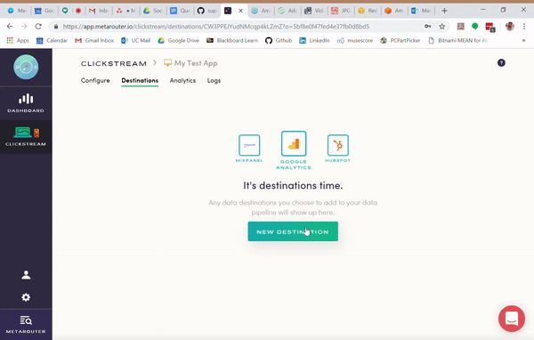

MetaRouter makes it easy to send your data to Amazon Redshift. Once you follow the steps below, your data will be routed through our platform and pushed to Redshift in the appropriate format. Before we get started, there are a few important things to note about our Redshift integration.

1. You will not immediately see events in your Redshift upon configuration. The first time your data is loaded into Redshift, it will take some added time to run DDL logic to create tables, add columns, etc.

2. Data is not streamed into Redshift in real time as it is for our other destinations. Rather, our Redshift loader operates on an hourly basis and each hourly job is queued up 15 minutes after the next hour starts. For example, the load for 2-3 PM will queue at 3:15 PM.

3. You will need to whitelist our IP address in order for us to load data into your Redshift. The whitelist IP's are listed below.

Now, to the good stuff!

## What is Amazon Redshift?

Redshift is Amazon Web Services' custom take on a traditional Postgres database. In Amazon's words, it is "[A fully managed petabyte-scale data warehouse service in the cloud.](http://docs.aws.amazon.com/redshift/latest/mgmt/welcome.html)" It's cost-effective at nearly any level, capable of scaling from gigabytes to petabytes without a loss in performance, and uses [columnar storage](http://docs.aws.amazon.com/redshift/latest/dg/c_columnar_storage_disk_mem_mgmnt.html) (among other optimizations) for incredibly fast querying speeds.

## Why send data to Amazon Redshift using MetaRouter?

This guide will explain how to integrate Redshift into MetaRouter's platform as a destination, allowing you to leverage Amazon's technology to access, store, and query your customer data.

Our connector periodically runs an ETL (Extract - Transform - Load) process that pulls raw event data in S3, processes and transforms those raw events into a structured format, and then inserts structured event data from our bucket into your Redshift cluster.


# Getting started with Amazon Redshift

## Step 1. Pick a cluster that fits your needs

***Note**: If you already have a Redshift cluster, go ahead to step 3*

 Once you've logged into your AWS account and Redshift console, it's time to pick and select your cluster.

 As you do this, remember that the capacity you'll need and utilize depends primarily on the number of unique tables and columns created in the cluster, not the number of events (database records).
 Each unique `track` event creates a new table, and each property sent creates a new column in that table. For this reason, think about creating a detailed tracking plan to make sure that all events being passed to MetaRouter are necessary and consistent.

 There are two kinds of Redshift clusters, Dense Compute and Dense Storage.


#### Dense Compute Cluster

Dense Compute clusters maximize query speed and performance, but in turn have less capacity for storage. While there is no set process to size a cluster, most customers with less than 20 million monthly events start with a single DC1 cluster and add nodes as needed. A single node cluster includes 200GB of storage and a maximum side of 2.56TB.

#### Dense Storage Cluster

Dense storage clusters maximize storage capacity and allow customers with hundreds of millions of events to save money on Redshift hosting costs by using disk-based storage, slower CPU's, and less RAM. A single DS2 node cluster includes 2TB of space, with a max size of 16TB.

---

## Step 2. Provision your cluster

1. Open the Redshift Console
2. Click on "Launch Cluster"
3. Input cluster details
4. Choose cluster size
5. Set up your cluster Security Group or VPC and proceed to review

If you're having trouble, check out the configuration steps [here](http://docs.aws.amazon.com/redshift/latest/gsg/rs-gsg-launch-sample-cluster.html).

---

## Step 3. Permission MetaRouter to Redshift

Once you provision your Redshift cluster, you'll need to configure your Redshift cluster to allow MetaRouter to access it.

### Confirm and Insert Credentials

The <i>Username</i> and <i>Password</i> you used to initially create the cluster are the credentials you'll put into your MetaRouter account. You should NOT use your master AWS credentials here. If you want to switch clusters in the future, make sure you update your Username and Password as needed.

For MetaRouter, having *distinct users* will allow you to (i) isolate queries from one another and (ii) perform audits more easily.

To create a new user, you'll need to log into the Redshift database directly. Here's the SQL command:

```
-- create a user named "metarouter" that MetaRouter will use when connecting to your Redshift cluster.
CREATE USER metarouter PASSWORD "<enter password here>";

-- allows the "metarouter" user to create new schemas on the specified database. (this is the name you chose when provisioning your cluster)
GRANT CREATE ON DATABASE "<enter database name here>" TO "metarouter";
```

**Note: Because we do not persist or store your data, MetaRouter will be unable to recover any events lost due to improper Redshift credentials or configuration by the user.**

### Configure Security Groups
Redshift clusters can either be in a EC2 Classic subnet or VPC subnet

If your cluster has a field called `Cluster Security Groups`, go ahead to EC2-Classic.

If your cluster has a field called `VPC Security Groups`, go ahead to EC2 VPC.

**EC2-Classic**

1. Navigate to your Redshift Cluster settings
```
Redshift Dashboard > Clusters > Select Your Cluster
```

2. Click on the Cluster Security Groups

3. Open the Cluster Security Group

4. Click on "Add Connection Type"

5. Authorize MetaRouter to write into your Redshift Port by inputting our IP Addresses: `35.245.140.149` and `35.236.193.215`

**EC2-VPC**

1. Navigate to your Redshift Cluster settings
```
Redshift Dashboard > Clusters > Select Your Cluster
```

2. Click on the VPC Security Groups

3. Select the "Inbound" tab and then "Edit"

4. Authorize MetaRouter to write into your Redshift Port by inputting our IP Addresses: `35.245.140.149` and `35.236.193.215`

5. Navigate back to your Redshift Cluster Settings

6. Select the "Cluster" button and then "Modify"

7. Make sure the "Publicly Accessible" option is set to "Yes"


### Whitelist MetaRouter's IP.
Make sure that you whitelist `35.245.140.149` and `35.236.193.215` as an incoming IP Addresses so we can write to your Redshift instance without you exposing the database to everyone.

---

## Step 4: Identify Your Host, Port, and Database Name

The Host and Port are found at the top beside the label 'Endpoint,' with Host coming before the ':' and Port coming afterwards. The Database Name is found at the bottom besides a title of the same name.


---

## Step 5: Activate Integration on MetaRouter

After you've identified the <b>Username, Password, Host, Port,</b> and <b>Database Name</b>, put all of these credentials into your MetaRouter account and give your new connection a unique name.

Note that your *Database* and *Schema* are kept separate from your other connection credentials. *Schema* is required, but it's up to you to decide what value to input - think of it as a folder to store your clickstream in. Example values include `analytics_ios`, `clickstream_web`, etc.

Click `Create Destination` and your pipeline will be activated.

That's it! You'll now be receiving a livestream of data from your application into your private Redshift account.




## Things to note

### Reserved Words

Redshift limits the number of [reserved words](http://docs.aws.amazon.com/redshift/latest/dg/r_pg_keywords.html) in schema, table, and column names. We'd also encourage you to stay away from naming traits or properties that conflict with top level clickstream fields (i.e. userID, receivedAt, messageID).

### Query Speeds

The speed of your queries depends on the capabilities of your hardware, the size of the dataset, and the amount of data utilization in the cluster. For instance, you might see lower query speeds if you find yourself above 75% data utilization.

### Naming Conventions

Be sure that the `Database` field exactly matches your Redshift `Database Name`. MetaRouter will create a new schema within this database, but will not automatically create a new database for you. 

If you wish to create a completely new database for your clickstream data, you can read about how to do that [here](http://docs.aws.amazon.com/redshift/latest/dg/r_CREATE_DATABASE.html).

### Static Data Types

We create columns and store data as strings (VARCHAR) within Redshift and do not preserve the original data type of event attributes. Instead, we ask that you rely on Redshift's built in dynamic data type formatting features at query time in order to format the data into the correct type that you need. Learn more on these features on [AWS Documentation > Data Type Formatting Functions](https://docs.aws.amazon.com/redshift/latest/dg/r_Data_type_formatting.html)
