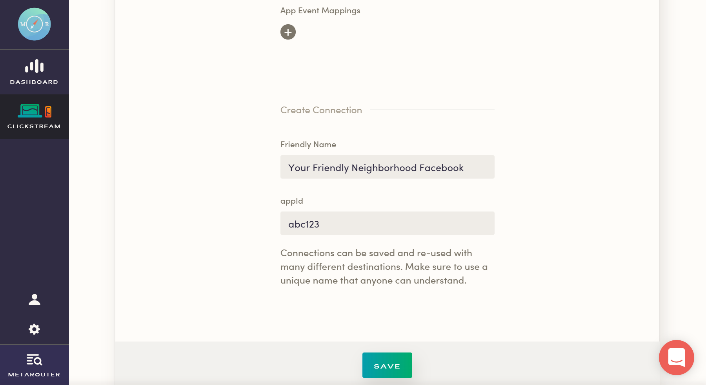

Available for server-side and mobile sources, MetaRouter makes it easy to send your data to Facebook App Events. Once you follow the steps below, your data will be routed through our platform and pushed to Facebook App Events in the appropriate format.

## What is Facebook App Events and how does it work?

Adding app events to your application or website helps you learn more about your audience and the actions people take across channels within Facebook Analytics. Plus, you can use app events to:

- Measure your mobile app ad performance
- Build Custom Audiences
- Optimize mobile app engagement ads

Facebook App Events are powered by Facebook SDKs that you'll have to separately install and configure in your iOS and Android apps. Facebook also has a JavaScript library for collecting events from your site code.

It's also worth noting that Facebook has a standard set of events that need to be installed for various industry verticals. Otherwise, Facebook supports custom events so that your team can add location, and event details for promotion purposes.

[Learn more about Facebook App Events](https://developers.facebook.com/docs/app-events)

## Why send data to Facebook App Events using MetaRouter?

With MetaRouter's Facebook App Events integration, you won't need to write custom code or bundle Facebook SDKs. Just integrate one of MetaRouter's latest mobile SDKs into your app and we'll send all the data we collect to Facebook via our servers. Plus, you'll be able to map any of your existing MetaRouter events to other Facebook App Event event names. User traits like birthday, city, gender, etc. get passed directly through to [Facebook Pixel](facebook-pixel.md).

In short, skip the manual headache and get straight to insights with MetaRouter.

## Getting Started with Facebook App Events and MetaRouter

### Facebook App Events Side

Once you have a Facebook Apps account, all you'll need to do is retrieve your 15-digit App ID. You can find this directly on your [dashboard](https://developers.facebook.com/apps/).

### MetaRouter Side

Now that you have what you need from the Facebook Apps side, go ahead to your MetaRouter [dashboard](https://app.metarouter.io/login).

Input your `appid` and App Event Mappings. Note that we'll automatically translate events so that they're passed to Facebook in the correct format.

The standard event mappings are listed below - any standard event fired will be translated to the corresponding Facebook event.

| Value | Translation |
|-------|-------------|
| Application Installed | MOBILE_APP_INSTALL |
| Application Opened | fb_mobile_activate_app |
| Products Searched | fb_mobile_search |
| Product Viewed | fb_mobile_content_view |
| Product Added | fb_mobile_add_to_cart |
| Product Added to Wishlist | fb_mobile_add_to_wishlist |
| Payment Info Entered | fb_mobile_add_payment_info |
| Checkout Started | fb_mobile_initiated_checkout |
| Order Completed | fb_mobile_purchase |

For any event that's not listed above (a custom event that you would like to be translated to a specific Facebook standard event) you need to fill out the `event mappings` section of this destination. Place the event name of your `track` call in the `key` column on the left hand side (e.g. `Added to Cart`) and the corresponding `value` from the table above on the right hand side (e.g. `fb_mobile_add_to_cart`). Be sure that the names are spelled correctly!

For any custom event that's not mapped, we'll send the exact event name to Facebook. Please note that Facebook App Events doesn't like events with periods in the name so if you send us an event with periods in the name, we'll convert all periods to underscores. So if your event is `friend.added`, we'll send that to Facebook as `friend_added`. We also truncate events that are longer than 40 characters long due to Facebook's API constraints.

As a final step, give your destination a unique name in the `Friendly Name` box.

With that, just click on `Save` to active your pipeline!
