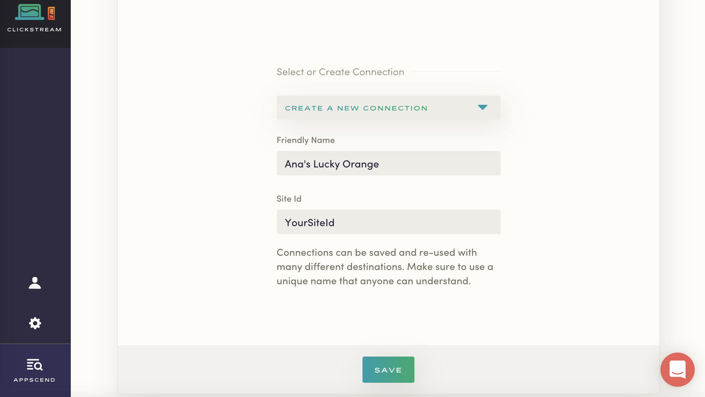
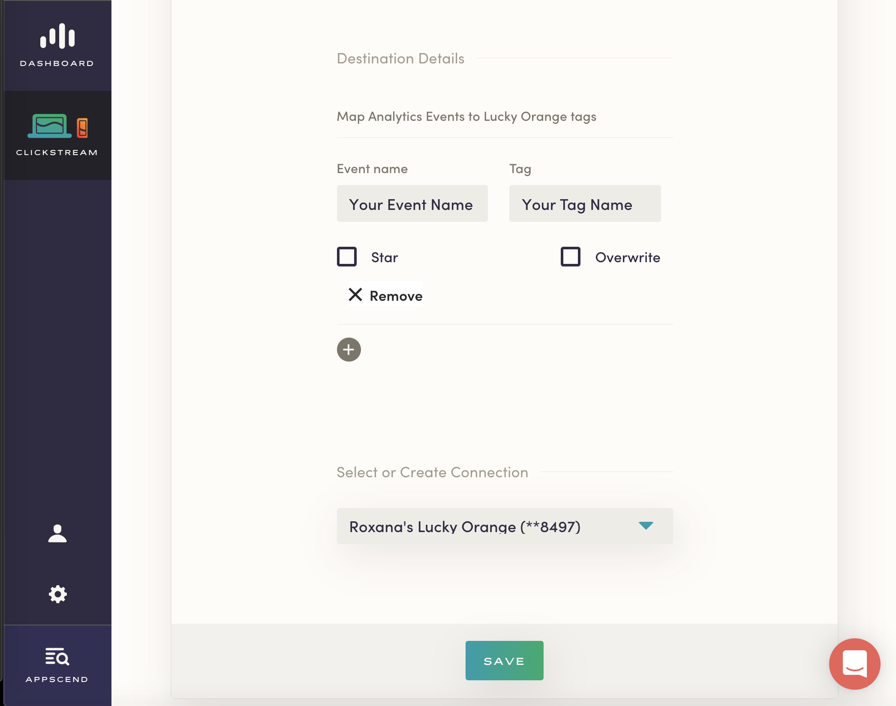
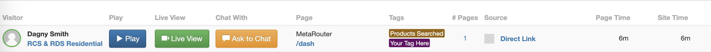

MetaRouter makes it easy to send your data to [Lucky Orange](https://www.luckyorange.com/). Once you follow the steps below, your data will be routed through our platform and pushed to Lucky Orange in the appropriate format.

## What is Lucky Orange and how does it work?

Lucky Orange lets you see users on your site and interact with them in many ways. With Lucky Orange, you can chat with visitors on your site, watch their mouse movements (eye tracking) on the screen, and scroll depth, clicks in real time, play them back as recording, generate heat maps of clicks, create quick polls, and more.


## Why send data to Lucky Orange using MetaRouter?

With MetaRouter, you can use Lucky Orange without having to install their JavaScript library on every page of your site. We also eliminate the need to write custom code to track behavior tags. Once your Lucky Orange is routed through MetaRouter, our platform translates page views and events into corresponding Lucky Orange events.

## Getting Started with Lucky Orange and MetaRouter

To get started sending events to Lucky Orange, first sign up for [an account](https://www.luckyorange.com/).

***Note**: Lucky Orange is available as a client-side destination only.*

### Lucky Orange Side

Begin by logging into your [Lucky Orange](https://www.luckyorange.com/) account. Create a new site by clicking `Add a New Site` button from top right. The next page will show your Lucky Orange tracking code for your site.


The generated Lucky Orange tracking code contains your site id (shown blured in the above image). Copy this value.

***Note**: You can always grab this value by accessing Settings > General.*

### MetaRouter Side

Back in the MetaRouter UI, select Lucky Orange as a destination and give your new pipeline a unique name. Add your Site Id into the Lucky Orange connector on your MetaRouter dashboard and give your new connection a unique name.



This settings page allows you to connect an [e-commerce event](https://docs.metarouter.io/v2/clickstream/ecommerce.html) with a Lucky Orange tag - you don't need to create the behavior tag on you Lucky Orange dashboard, triggering an event will automatically assign it the tag you defined on the MetaRouter dashboard.

#### Auto-Tagging

Auto-Tagging option will send all analytics.js triggered events from your website to Lucky Orange's API. You can customize your tags with each `track()` call - more details on [Track section](#track).



#### Custom mapping

To map an event to a specific tag, unckeck *Auto-Tagging* option - *Map Analytics Events to Lucky Orange tags* section wiil be available. Here you can define your own mappings between an [e-commerce event](https://docs.metarouter.io/v2/clickstream/ecommerce.html) and a Lucky Orange tag by clicking the **+** button. The values that you can add here are the following:

* Event name (required) - the name of your analytics.js event
* Tag (required) the name of your Lucky Orange tag
* Star - by checking this box, the triggered tag will be starred on your Lucky Orange's dashboard
* Overwrite - by checking this box, the triggered tag will overwrite any existing tags on your Lucky Orange's dashboard

***Note:** Only triggered events that have a mapping defined will be sent to Lucky Orange's APIs.*


You can map as many events you need.

Finally, click `Save` to activate your pipeline.

### Identify

If you haven't had a chance to review our spec, please take a look to understand what the [Identify method](https://docs.metarouter.io/v2/clickstream/calls.html#identify) does. An example call would look like:

```javascript
analytics.identify("1205119", {
  name: "Dagny Smith", 
  email: "dagny@metarouter.io", 
});
```

Calling `identify()` will create/update visitors in Lucky Orange. All traits are sent to Lucky Orange and each trait will create a new column in the visitor's view. If name and email are set in an `identify()` call, Lucky Orange will also try to find an Gravatar associated with the user.


### Track

If you haven't had a chance to review our spec, please take a look to understand what the [Track method](https://docs.metarouter.io/v2/clickstream/calls.html#track) does. An example call would look like:

```javascript
analytics.track("Your Event Name", {});
```

Based on your configuration, there are 2 possible scenarios, as described below.

#### Auto-Tagging enabled

This option allows you to fire events without needing to map it on your configurations page on MetaRouter's dashboard.
For flexibility, there are a few ways for you to benefit of. Here are some examples:

* Default `track()` usage

  ```javascript
  analytics.track('Products Searched', {
    query: 'white dress'
  });
  ```

  Since no custom data is set inside properties, default values used are as follows:

  * tag - event name - for this example, tag will be 'Products Searched'
  * star - `false`
  * overwrite - `false`

  

* Custom `track()` usage

  You can customize each `track()` call with these properties:

  * `tag` *(optional, defaults to event's name)* - **String** - Lucky Orange tag name
  * `star` *(optional, default `false`)* - **Boolean** - Lucky Orange star property
  * `overwrite` *(optional, default `false`)* - **Boolean** - Lucky Orange overwrite property

  ```javascript
  analytics.track('Products Searched', {
    query: 'white dress',
    tag: 'Your Tag Here',
    star: true,
    overwrite: true
  });
  ```

  

#### Auto-Tagging disabled & Mapped Analytics Events to Lucky Orange tags available

Calling track will create or use an already existing Lucky Orange behavior tag based on your defined mapping. If an event is triggered and there's no corresponding mapping for it, it won't reflect on Lucky Orange's dashboard.


With that, you're all set! Get ready for insights.
