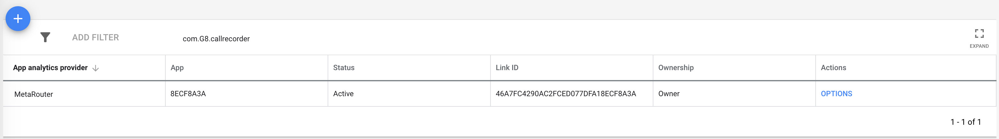

MetaRouter makes it easy to send your data to [AdWords](https://ads.google.com) (and lots of other destinations). Once you follow the steps below, your data will be routed through our platform and pushed to AdWords in the format they understand.


## Why send data to AdWords using MetaRouter?

With MetaRouter, you can use AdWords without having to install their JavaScript library on every page of your site. We also eliminate the need to write custom code to track user event data. Once AdWords is routed through MetaRouter, our platform makes calls directly to AdWords based on your mapped events.

## Getting Started with AdWords and MetaRouter


### AdWords Side

To get started with this integration, you’ll first need to have access to a AdWords account. The information that you'll need moving forward is your AdWords link Id and dev token.


### MetaRouter Side

The AdWords destination allows you to make calls directly to AdWords based on your mapped events. All you have to do is to add your settings and map the Analytics.js track events to their corresponding AdWords labels in the configuration file as described below.

#### Configuration file

This configuration file allows you to set your own configuration based on how you interact with AdWords. Here's a configuration file that includes all the settings that you can apply - `appId` and `advertiserId` are the only mandatory fields, everything else is optional.

```yaml
- name: "adwords"
  config:
    linkId: "LINK_ID"
    dev_token: "DEV_TOKEN"
    events:
      - event: "Order Completed"
        label: "purchase"
        conversionId: "YYYYYYYYYYY"
        customVariables:
          checkout_id: "checkout_id"
    useDefaultMapping: false
```

- `linkId` - String, **required**
  - To authorize MetaRouter to track conversion events using the AdWords API on your behalf, you must generate a Link ID in your AdWords Account - see details [here](#generate-a-link-id-in-your-adwords-account)
- `dev_token` - String, **required**
  - Value available on your AdWords dashboard.
- `events` - Object, **optional**
  - `event`
    - Analytics.js event name
  - `label`
    - AdWords recognizes labels, not custom events - we'll use this label for this event on our calls to AdWords.
  - `conversionId` - String, **optional**
    - You can opt to override the default conversion ID by setting one here.
  - `customVariables` - Object, **optional**
    - Map Analytics.js event properties (on the left) to AdWords custom variables and we'll insert the value of that property in the corresponding AdWords custom variables (on the right).
- `useDefaultMapping` - Boolean, **optional**, default value `false`
  - By default, we map some of the Analytics.js Standard E-commerce events to AdWords events, as follows:

    | **Analytics.js event** | **AdWords event** |
    | --------------------- | --------------------- |
    | `Application Installed` | `first_open` |
    | `Product List Viewed` | `view_item_list` |
    | `Product Added` | `add_to_cart` |
    | `Product Viewed` | `view_item` |
    | `Products Searched` | `view_search_results` |
    | `Order Completed` | `ecommerce_purchase` |


### Generate a Link ID in your AdWords Account
Authorization between an AdWords account and a third-party-application is done via the use of a Link Id. This process is detailed [here](https://support.google.com/google-ads/answer/7365001).

Once this step is complete, you should see a screen that looks like this showing the new Link Id:

