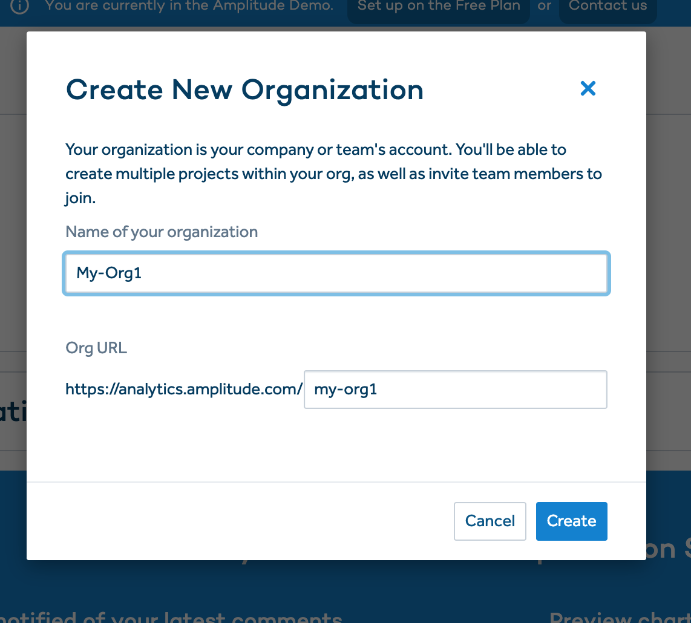
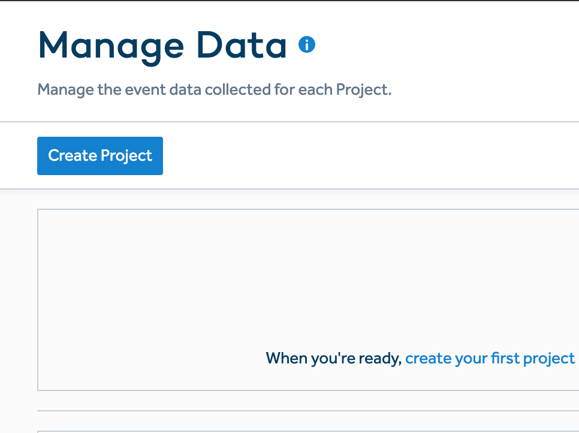
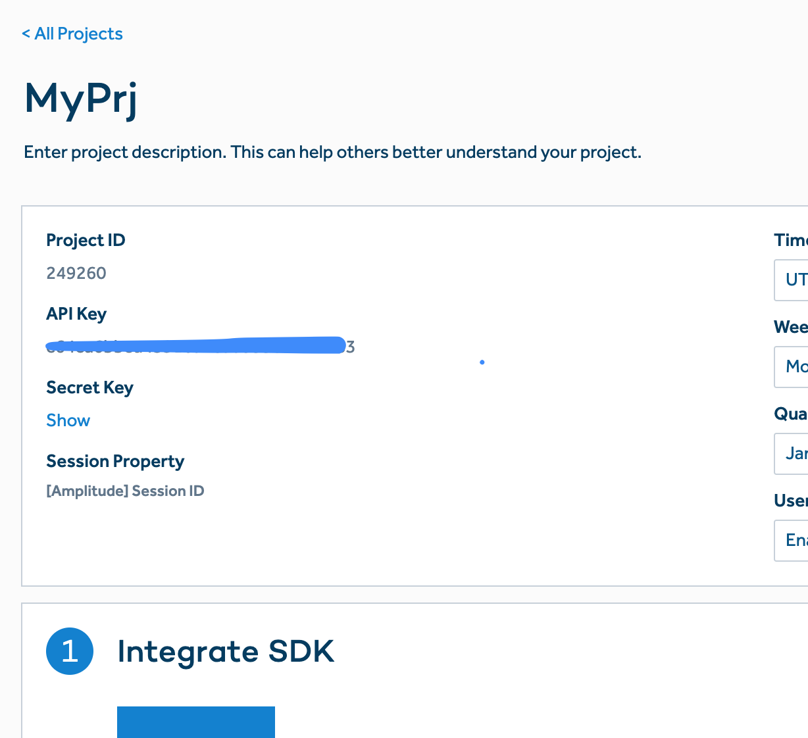

MetaRouter makes it easy to send your data to Amplitude. Once you follow the steps below, your data will be routed through our platform and pushed to Amplitude in the appropriate format.

## What is Amplitude and how does it work?

Amplitude is a behavioral data analytics tool that enables real-time cross-platform analytics so that marketers can view user activity on a dashboard. It also funnels audiences by custom events and actions like checkout completed, items added to cart, or payment entered. It integrates very nicely with Amazon Redshift for data access so that data scientists can analyze user drop off over time.

Implementing Amplitude natively in your stack requires a good amount of developer work; sending them user data requires mapping out your events and user traits to be collected and deciding which libraries and SDKs you'll need to use. You'll then need to install your libraries and SDKs of choice on all of your products.

[Learn more about Amplitude](https://amplitude.com/)

## Why send data to Amplitude using MetaRouter?

If you want to try out any other analytics application, implementing native event tracking for Amplitude is a waste of time. Going through the process of selecting and installing libraries and SDKs just for one tool will take your engineers a lot of time. Furthermore, if you plan to add more tools to your stack, the event tracking and custom coding work is going to be redundant and frustrating.

Integrating Amplitude with MetaRouter means that you will just need to install MetaRouter and enable Amplitude in your MetaRouter UI. You will only need to set up one event tracking library (MetaRouter's), and then you will be able to route and send data to Amplitude and any other destination of your choice without writing custom code for each one.

## Getting Started with Amplitude and MetaRouter

### Amplitude Side

To get started sending events to Amplitude, all you need is your API Key. After signing up for an Amplitude account, a page will load asking you to create an organization.



Hit Manage Data and Create Project. This will allow you to get your API Key.




After this application is created, an API Key will be generated and presented in your dashboard.



### MetaRouter Side

### Config

#### `apiKey` _(Required)_

The Amplitude Event API Key.

#### `trackPages`

Activated by default this setting sends all `page` and `screen` calls to Amplitude as `Loaded a Page`. This feature works with all source types. `default: false` will prevent the integration from sending events.

#### `trackNamedPages`

Will send all _named_ `page` and `screen` calls to Amplitude. There are two scenarios, depending on the way you're using `analytics.page()` call:

#### `analytics.page('(Category)', '(Name)')`

Will result into `Viewed (Category) (Name) Page` or `Viewed (Category) (Name) Screen` events on your Amplitude dashboard;

#### `analytics.page('(Name)')`

Will result into `Viewed (Name) Page` or `Viewed (Name) Screen` events on your Amplitude dashboard.
This feature works with Android, Server, and Web sources.

#### `trackCategorizedPages`

Means that every time you call `page` or `screen` and provide a `category`, an event will be sent. It will appear in Amplitude as `Viewed (Category) Page` or `Viewed (Category) Screen`. This feature works with all source types.

#### `mapQueryParams`

When sending data via server side, you can send the custom query params that are automatically collected by analytics.js (or whatever you manually send under context.page.search), by entering a custom property name you would like to map that under on the left hand side. On the right hand side, please choose whether you want the query params to be set on the user profile or event metadata level. Whatever you put on the left hand side we will map the entire query parameters string from the context.page.url. NOTE: Do not add more than one row. Adding more than one row in this setting will have no effect.

---

Below is a full example of the configuration to send into the Platform, with all of the defaults specified. Ensure to customize to match the data that you send as part of your analyitcs event.

```json
{
  "name": "amplitude"
  "apiKey":"<yourAmplitudeAPIKey>",
  "trackAllPages":true,
  "trackNamedPages":true,
  "trackCategorizedPages":true,
  "mapQueryParams":[
    {"user_properties":"name"},
    {"user_properties":"email"},
    {"event_properties":"source"},
    {"event_properties":"other"}
  ],
  "usePageDetailsForTrackCalls":true
}
```
