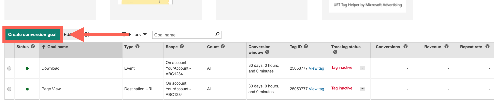
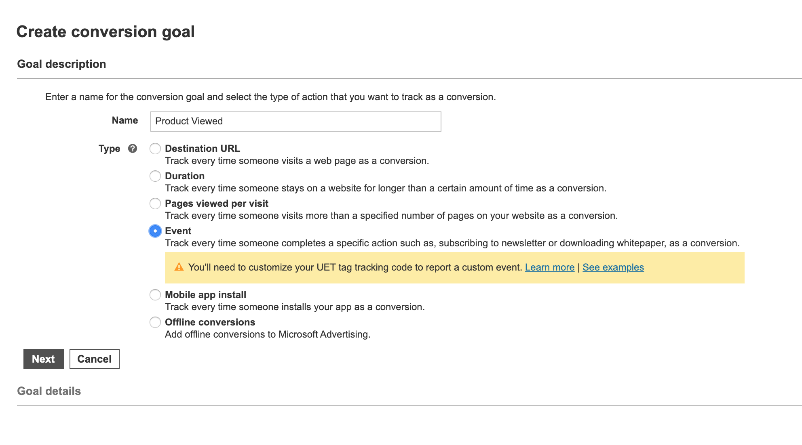
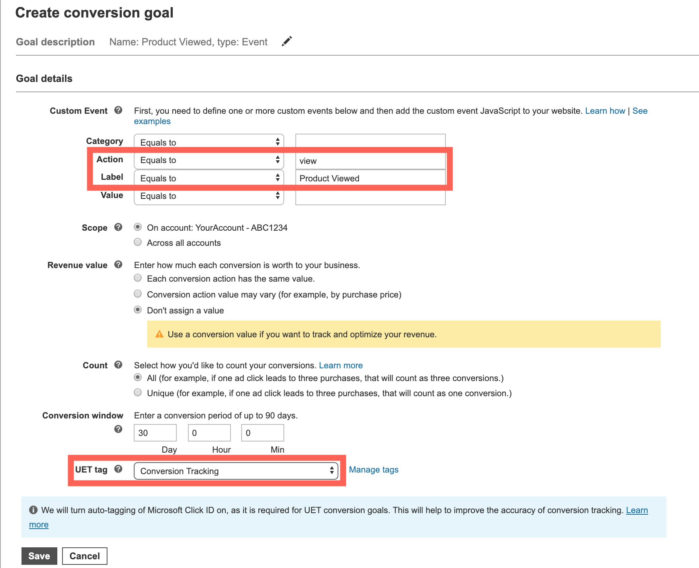
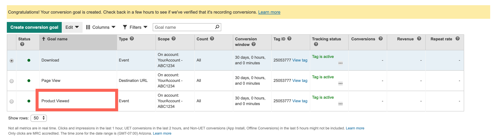

## What is Microsoft Advertising and how does it work?

Microsoft Advertising is a service that provides pay per click advertising on both the Bing and Yahoo! search engines. It enables it's users to monitor and track campaigns, clicks, CTRs, spend and budget. Microsoft Advertising lets you place cross-device product ads in front of Bing, Yahoo, and MSN customers and support imported pay-per-click ad campaigns from third-party platforms like Google AdWords. With Microsoft Advertising you can also retarget ads to customers after they complete an action like leaving a shopping cart or viewing a product without purchasing.

## Why send data to Microsoft Advertising using MetaRouter?

This integration can be very complicated to implement without MetaRouter; the base code for each customer is unique and must be obtained from the Microsoft Advertising UI. If you want to track custom events, you'll need to familiarize yourself with the Microsoft Advertising API to both locate the correct base and event tracking code as well as install it correctly into your own site. It typically needs to be added by a webmaster or developer to prevent errors.

Using MetaRouter, you can send page views and event data directly to Microsoft Advertising without needing to manually install any extra JavaScript on your website. Just enable the Microsoft Advertising destination in your MetaRouter UI, and we'll automatically take care of mapping a standard set of events to recognized Microsoft Advertising events. MetaRouter also allows you to define and map your own events to supported Microsoft Advertising events without any custom code. All of this data is immediately available for analysis in your Microsoft Advertising dashboard.

Integrating Microsoft Advertising with MetaRouter cuts out any need for additional implementation resources, saving your development team valuable time.

## Getting Started with Microsoft Tag and MetaRouter

### Microsoft Ads Side

To get started sending events to Pinterest, first sign up for [Microsoft Advertising](https://ads.microsoft.com/).

Before you can track conversions or target audiences, you need to [create a UET tag](https://help.bingads.microsoft.com/#apex/3/en/56682/-1) in Microsoft Advertising and then add it to the destination settings as described in the next section. Follow the steps within the Microsoft Advertising documentation to create a UET tag.

### MetaRouter Side

You can configure your integrations using a `integrations.yaml` config file, where you define multiple destinations, each one with its custom settings.

The only configuration needed is the `tagId`, which represents the id that you've got from the previous step.

Here is an example of `integrations.yaml`:

```yaml
- name: 'bing-ads'
  config:
    tagId: 'my UET tag id'
    customActionsMappings:
      - name: 'Order Completed'
        action: 'purchase'
      - name: 'Product Added'
        category: 'product'
        action: 'add'
```

In this configuration, `tagId` represents the ID that you've got from the previous step.

`customActionsMappings` list allows you to define your own custom event actions based on events that you track with `analytics.track()`. Using the config file from the example, when calling `analytics.track('Order Completed')` we'll send an event with `purchase` action to Microsoft Advertising. We use the following parameters:
_ `name`: your `track()` event.
_ `action`: the event send to Microsoft Advertising.

### Track

Because Microsoft Advertising offers Standard Event `custom` that is available for conversion reporting, for all Analytics.js events we send data to this one.

In order for us to map your track events to Microsoft Advertising Conversion Goal, you’ll first need to [create the Conversion Goal](https://help.bingads.microsoft.com/#apex/3/en/56689/2) on your Microsoft Advertising account:

On the left pane, click Conversion Tracking.


Under Conversion Tracking, click View Conversion Goals Page.


On the conversion goals page, click Create conversion goal.


Enter a name for your goal in the Goal name box. When naming your goal, use a descriptive name that makes sense to you. (For example, Order Completed)
Choose the `Event` type of conversion and click Next.


Fill in the appropriate values. Make sure to add the Metarouter event name as the label field and to associate the goal to the correct Tag (UET Tag) that is set up in your Metarouter source.
Only the event name is required - other properties are optional. An example track call is shown below:


You should be able to see your goal appeared in the goals list:


```
// Metarouter event
analytics.track('Order Completed', {
  action: 'purchase',
  revenue: 25,
  ... // additional properties
});
```

* Label: Event Name ('Order Completed' in this case)
* Value: `revenue` property
* Category: `category` property

### Page

We'll send all of your `analytics.page()` events to the standard Microsoft Advertising `pageLoad` event, after removing PII from the payload.
